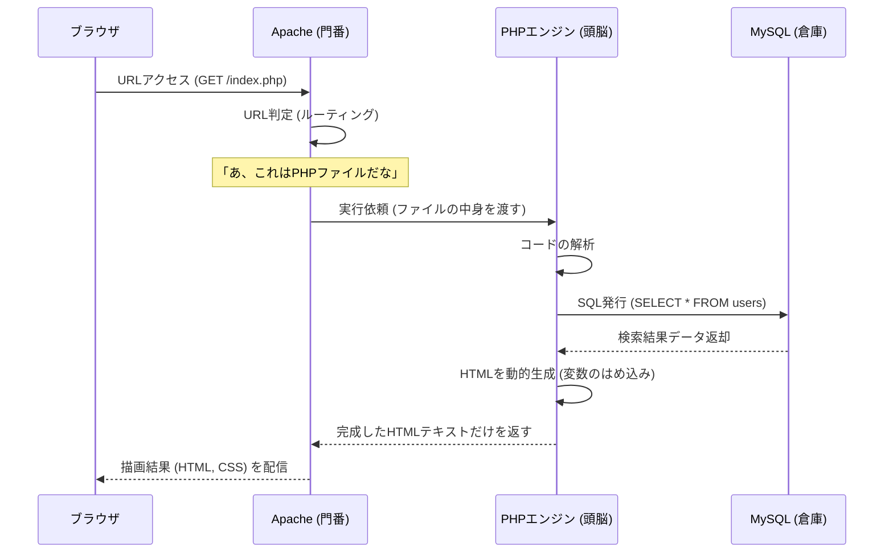

# 01. LAMPエコシステムと巨大な伝言ゲーム

Webの古き良き王道であり、近代Webシステムの祖先でもあるLAMP環境の真理を紐解きます。

## 1. LAMPアーキテクチャの全体像

LAMPとは、以下の4つの技術の頭文字です。
- **[L](#linux)**: Linux (全基盤となるOS)
- **[A](#apache)**: Apache (HTTPを待ち受けるWebサーバー)
- **[M](#mysql)**: MySQL / MariaDB (データ保管庫)
- **[P](#php)**: PHP / Python / Perl (処理する頭脳)

これらの技術は「独立した別々のプログラム」であり、互いに「伝言ゲーム」を行うことで1つのWebサイトの描画を完了させます。

## 2. リクエスト処理フローの真実

ユーザーがブラウザで `https://example.com/index.php` にアクセスした際、サーバー内部で起きているリアルな流れは以下の通りです。

1. **門番の振り分け (Apache)**: Apache単体はただのファイル配りマシンです。テキストや画像を配ることはできますが、データベースに繋ぐ能力はありません。
2. **通訳と加工 (PHP)**: Apacheから依頼を受けたPHPモジュールがソースコードを実行し、データベースにアクセスします。
3. **完成品の受け渡し**: PHPの実行が完了すると、ソースコードは消え去り、「純粋なHTML文字列」に変貌します。これをApacheがブラウザへ送り返します。これが**サーバーサイド・レンダリング (SSR)** の元祖です。

## 3. 実務でのアンチパターンと失敗例

- ❌ **Web公開ディレクトリに生のバックエンドファイルを置く**
  - もしApacheの設定に不具合があり「PHPを実行する設定」が外れてしまった場合、ユーザーから `/index.php` にアクセスされた際に**「PHPのソースコードそのもの（DBのパスワード等）」が丸見えでダウンロード可能になってしまう**恐怖のインシデントに繋がります。フロント側（public）とバック側の階層を分離するフレームワーク設計（Laravel等）が現代の常識です。
